# Airflow → Snowflake Healthcare Data Pipeline

## Project Overview

This project demonstrates a production-style data pipeline orchestrated with **Apache Airflow (AWS MWAA)** and built on **Snowflake** using a **Bronze / Silver / Gold** architecture.

The goal of the project was to show hands-on experience with:

* Managed Airflow (MWAA)
* AWS infrastructure and IAM configuration
* Snowflake external stages and storage integrations
* Parallelized orchestration patterns
* Realistic data warehouse modeling

All AWS resources were intentionally **torn down after completion** to avoid ongoing cloud costs. This repository preserves architectural decisions, execution proof, and screenshots to validate the work.

---

## High-Level Architecture

**Flow summary:**

1. Airflow DAG downloads public healthcare CSV datasets
2. Files are uploaded to Amazon S3
3. Snowflake copies raw data into Bronze tables
4. Stored procedures transform data into Silver tables
5. Aggregated Gold tables are created for analytics

> All ingestion and transformation steps are executed **in parallel** where possible.

### Architecture Diagram

> **Screenshot:**

```

```

---

## Technologies Used

* Apache Airflow (AWS MWAA)
* Amazon S3
* AWS IAM (roles, trust relationships)
* Snowflake
* Python
* SQL (Snowflake stored procedures)

---

## Detailed Implementation Steps

### 1. AWS IAM Configuration

* Created a dedicated IAM Role for Snowflake access
* Role was later used in a Snowflake Storage Integration

**Screenshot:**

```
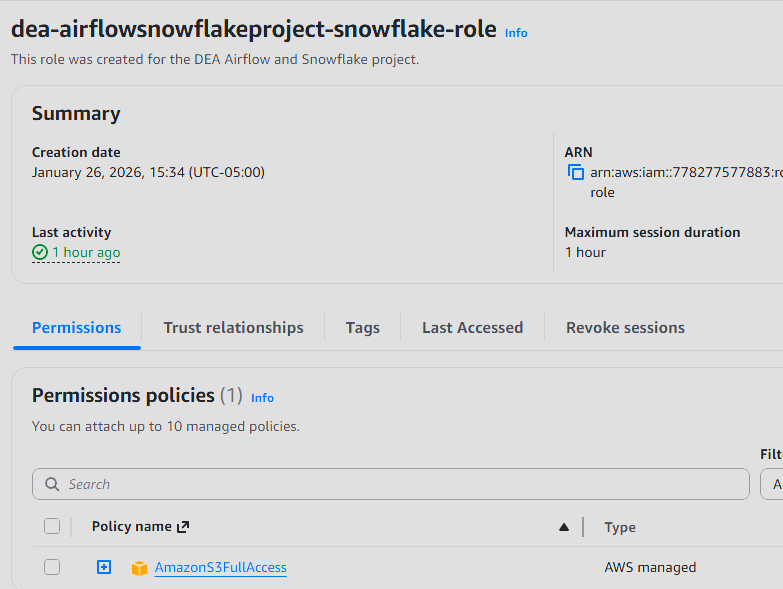
```

---

### 2. Amazon S3 Setup

Two S3 buckets were created:

1. **Airflow bucket**

   * Contains `dags/` directory
   * Contains `requirements.txt`

2. **Data bucket**

   * Stores healthcare CSV datasets

**Screenshots:**

```
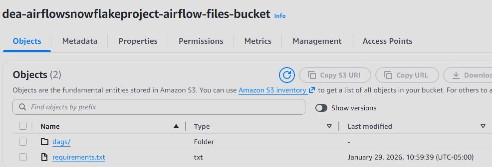
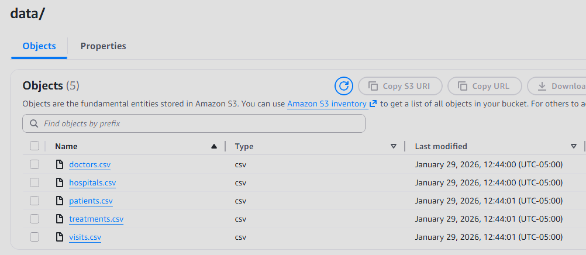
```

---

### 3. Snowflake Environment Setup

In Snowflake:

* Created a project database
* Created **Bronze**, **Silver**, and **Gold** schemas
* Created a **Storage Integration** using the IAM Role ARN
* Retrieved Snowflake-generated AWS User ARN and External ID
* Updated IAM Role trust relationship
* Created an External Stage pointing to the S3 data bucket

**Screenshots:**

```
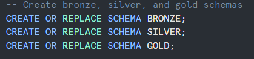
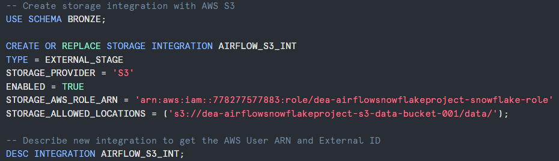
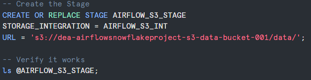
```

---

### 4. Bronze Schema (Raw Tables)

Five raw tables were created:

* DOCTORS_RAW
* HOSPITALS_RAW
* PATIENTS_RAW
* TREATMENTS_RAW
* VISITS_RAW

**Screenshot:**

```

```

---

### 5. Silver Schema Transformations

* Three Snowflake stored procedures
* Each procedure transforms raw Bronze data
* Outputs structured Silver tables

**Screenshot:**

```
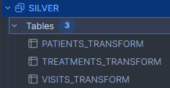
```

---

### 6. Gold Schema Aggregations

* Four stored procedures
* Produces analytics-ready tables
* Designed for reporting and BI use cases

**Screenshot:**

```
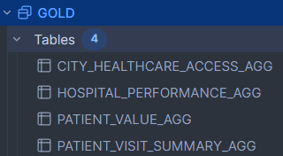
```

---

### 7. AWS MWAA (Managed Airflow) Setup

* Created MWAA environment
* Provisioned a new VPC and Security Group
* Created a dedicated MWAA execution role
* Granted S3 access
* Connected MWAA to the Airflow S3 bucket

**Screenshots:**

```
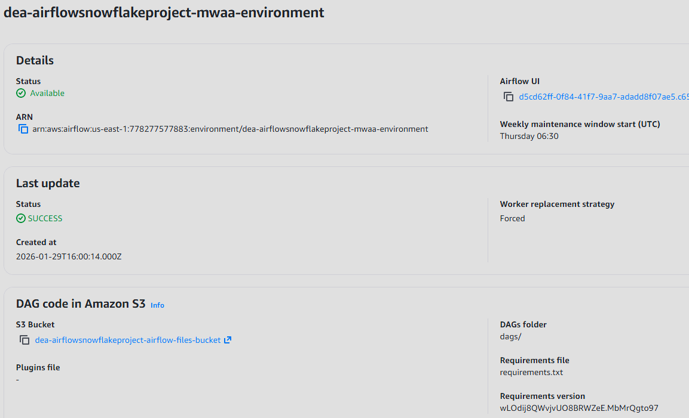
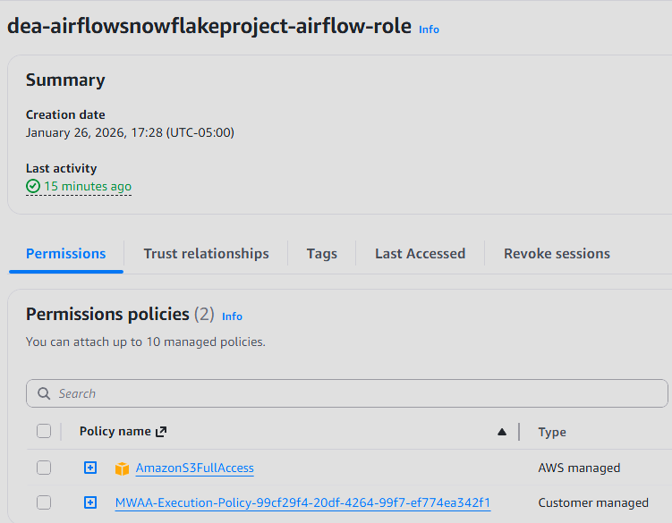
```

---

### 8. Airflow Snowflake Connection

* Created a Snowflake connection in Airflow
* Tested connectivity with a simple DAG
* Verified execution via Snowflake query history

**Screenshots:**

```
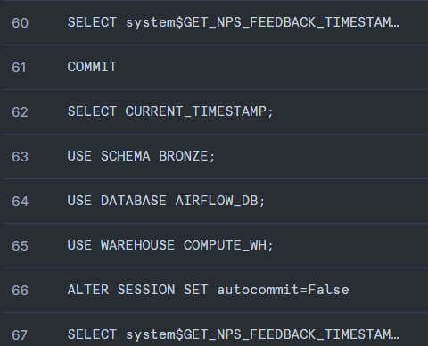
```

---

### 9. Production DAG Execution

The final DAG performs the following steps:

1. Downloads healthcare CSV files from a public GitHub repository
2. Uploads files to the S3 data bucket
3. Copies data into Bronze tables (parallel)
4. Executes Silver stored procedures (parallel)
5. Executes Gold stored procedures (parallel)

**Screenshots:**

```
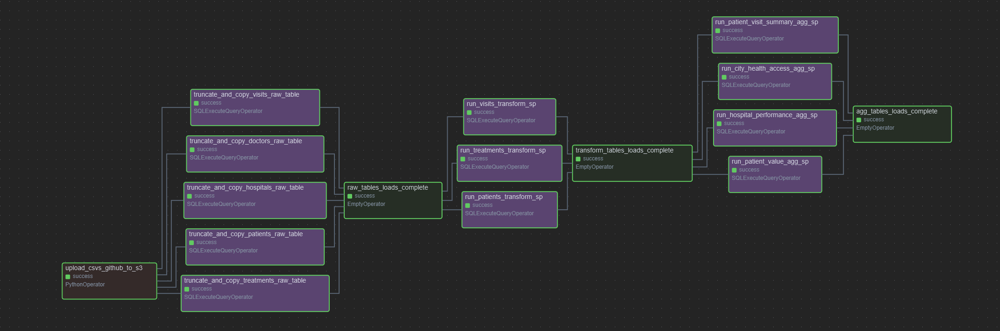
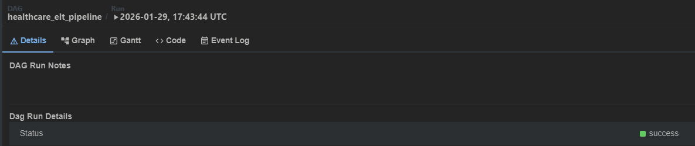
```

---

### 10. Verification

* Confirmed DAG success in Airflow UI
* Verified table creation and row counts in Snowflake

**Screenshot:**

```
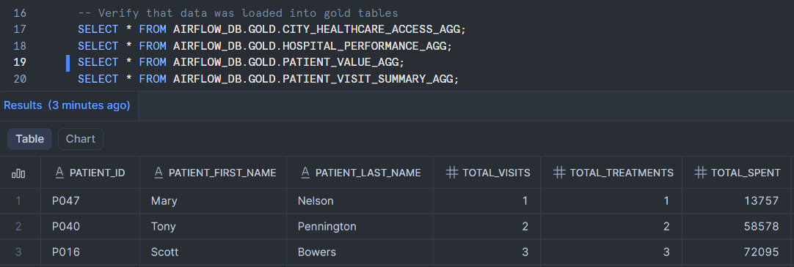
```

---

## Repository Structure

```
.
├── README.md  
├── data/  
│   ├── doctors.csv  
│   ├── hospitals.csv  
│   ├── patients.csv  
│   ├── treatments.csv  
│   └── visits.csv  
├── sql/  
│   ├── snowflake_setup.sql    
│   ├── create_storage_integration.sql    
│   ├── create_stage.sql  
│   ├── create_raw_tables.sql    
│   ├── silver_stored_procedures.sql   
│   ├── gold_stored_procedures.sql   
│   └── validate_data.sql  
├── dags/  
│   ├── airflow_healthcare_pipeline.py  
│   └── test_snowflake_connection.py  
├── architecture/  
│   └── airflow_snowflake_pipeline.png  
├── screenshots/  
│   ├── airflow/  
│   ├── aws/  
│   └── snowflake/  
└── requirements.txt  
```

---

## Key Skills Demonstrated

* End-to-end data pipeline orchestration
* AWS MWAA production setup
* Secure Snowflake ↔ AWS integration
* Parallel data processing
* Warehouse modeling (Bronze / Silver / Gold)
* Cost-aware cloud teardown practices

---

## Notes for Reviewers

* All cloud resources were decommissioned after validation
* Screenshots are included to prove successful execution
* Project emphasizes real-world patterns over tutorials

---

## Author

**Johnathon Smith**
Data Analyst transitioning to Data Engineer
Focused on AWS, Snowflake, and modern data platforms
